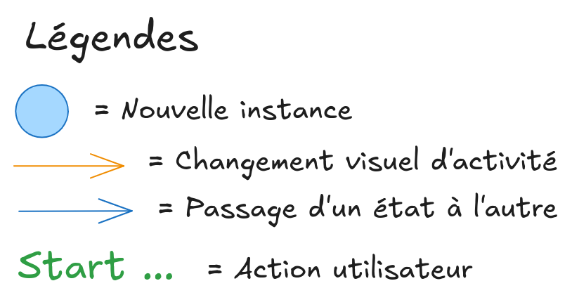
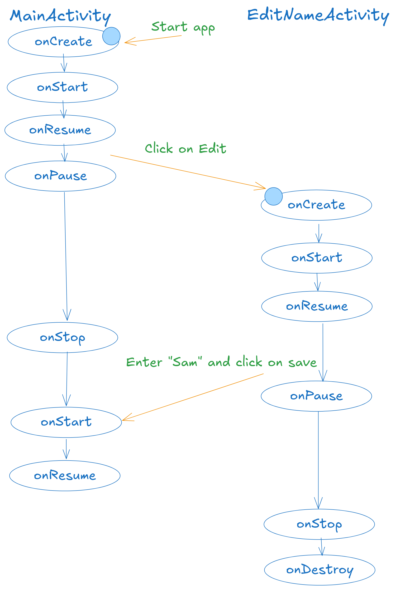
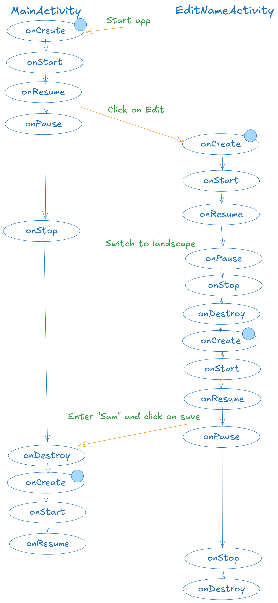

# DAA - L2 - 2024-10-03

Authors: REDACTED, REDACTED, Quentin Surdez

## 1. Activités

> Que se passe-t-il si l’utilisateur appuie sur « back » lorsqu’il se trouve sur
> la seconde Activité ?

On revient à la première activité mais le changement de nom n'aura pas été
sauvé. Le message de bienvenue n'aura pas changé. Sans surprise, en cliquant à
nouveau sur « Editer » on reviendra sur l'activité 2 avec le nom précédent.

> Veuillez réaliser un diagramme des changements d’état des deux Activités pour
> les utilisations suivantes, vous mettrez en évidence les différentes instances
> de chaque Activité :
>
> - L’utilisateur ouvre l’application, clique sur le bouton éditer, renseigne
>   son prénom et sauve.
> - L’utilisateur ouvre l’application en mode portrait, clique sur le bouton
>   éditer, bascule en mode paysage, renseigne son prénom et sauve.

Légendes des schémas ci-dessous



**1er scénario** : Voici les logs filtrés et cleanup pour nos 2 activités
`MainActivity` et `EditNameActivity`.

```
start app
PROCESS STARTED (11467) for package ch.heigvd.iict.daa.basictemplate
2024-10-13 18:43:50.637 MainActivity       I  onCreate
2024-10-13 18:43:50.983 MainActivity       D  Setting name: veuillez entrer votre nom
2024-10-13 18:43:51.022 MainActivity       I  onStart
2024-10-13 18:43:51.032 MainActivity       I  onResume

click edit
2024-10-13 18:44:14.989 MainActivity       I  onPause
2024-10-13 18:44:15.113 EditNameActivity   I  onCreate
2024-10-13 18:44:15.340 EditNameActivity   D  Name: null
2024-10-13 18:44:15.351 EditNameActivity   I  onStart
2024-10-13 18:44:15.370 EditNameActivity   I  onResume
2024-10-13 18:44:16.569 MainActivity       I  onStop

after Sam and save
2024-10-13 18:44:32.303 EditNameActivity   I  onPause
2024-10-13 18:44:32.378 MainActivity       I  onStart
2024-10-13 18:44:32.381 MainActivity       D  Received name: Sam
2024-10-13 18:44:32.385 MainActivity       D  Setting name: Sam
2024-10-13 18:44:32.387 MainActivity       I  onResume
2024-10-13 18:44:34.247 EditNameActivity   I  onStop
2024-10-13 18:44:34.251 EditNameActivity   I  onDestroy
```

Diagramme associé



**2ème scénario** :

```
start
PROCESS STARTED (11757) for package ch.heigvd.iict.daa.basictemplate
2024-10-13 18:54:27.479 MainActivity       I  onCreate
2024-10-13 18:54:27.763 MainActivity       D  Setting name: veuillez entrer votre nom
2024-10-13 18:54:27.833 MainActivity       I  onStart
2024-10-13 18:54:27.843 MainActivity       I  onResume

click edit
2024-10-13 18:55:09.789 MainActivity       I  onPause
2024-10-13 18:55:09.884 EditNameActivity   I  onCreate
2024-10-13 18:55:10.087 EditNameActivity   D  Name: null
2024-10-13 18:55:10.101 EditNameActivity   I  onStart
2024-10-13 18:55:10.107 EditNameActivity   I  onResume
2024-10-13 18:55:11.322 MainActivity       I  onStop

switch to landscape
2024-10-13 18:55:28.731 EditNameActivity   I  onPause
2024-10-13 18:55:28.760 EditNameActivity   I  onStop
2024-10-13 18:55:28.776 EditNameActivity   I  onDestroy
2024-10-13 18:55:28.870 EditNameActivity   I  onCreate
2024-10-13 18:55:29.036 EditNameActivity   D  Name: null
2024-10-13 18:55:29.046 EditNameActivity   I  onStart
2024-10-13 18:55:29.056 EditNameActivity   I  onResume

name + save
2024-10-13 18:55:55.577 EditNameActivity   I  onPause
2024-10-13 18:55:55.614 MainActivity       I  onDestroy
2024-10-13 18:55:55.713 MainActivity       I  onCreate
2024-10-13 18:55:55.759 MainActivity       D  Setting name: veuillez entrer votre nom
2024-10-13 18:55:55.768 MainActivity       I  onStart
2024-10-13 18:55:55.773 MainActivity       D  Received name: Sam
2024-10-13 18:55:55.775 MainActivity       D  Setting name: Sam
2024-10-13 18:55:55.777 MainActivity       I  onResume
2024-10-13 18:55:57.037 EditNameActivity   I  onStop
2024-10-13 18:55:57.048 EditNameActivity   I  onDestroy
```

Diagramme associé



> Que faut-il mettre en place pour que vos Activités supportent la rotation de
> l’écran ? Est-ce nécessaire de le réaliser pour les deux Activités, quelle est
> la différence ?
>
> Hint : Que se passe-t-il si on bascule la première Activité après avoir saisi
> son prénom ? Comment peut-on éviter ce comportement indésirable ? Quelle est
> la différence avec la seconde Activité ?

Il est nécessaire de gérer explicitement la sauvegarde et la restauration de
l'état des Activités. Cela peut se faire en surchargeant la méthode
`onSaveInstanceState()` pour enregistrer l'état de l'Activité (comme le prénom
saisi par l'utilisateur) avant que celle-ci ne soit détruite par la rotation, et
en restaurant cet état dans la méthode `onCreate()` ou
`onRestoreInstanceState()`.

Pour la seconde Activité, oui, il est indispensable de gérer la rotation. Si
l'utilisateur entre un prénom et que la rotation intervient avant qu'il n'ait
cliqué sur « Sauver », il faut veiller à sauvegarder les données en cours.
Sinon, les données saisies seraient perdues lorsque l'activité est détruite et
recrée.

Pour la première Activité, ce n'est pas strictement nécessaire dans ce contexte,
car elle se contente de recevoir des données et d'afficher un message. Une fois
les données sauvegardées, elles ne sont pas affectées par une rotation d'écran.

## 2. Fragments

> Les deux Fragments fournis implémentent la restauration de leur état. Si on
> enlève la sauvegarde de l’état sur le ColorFragment sa couleur sera tout de
> même restaurée, comment pouvons-nous expliquer cela ?

Dans Android, le framework gère automatiquement la restauration de l'état de
certains fragments dans certaines conditions. En examinant le `ColorFragment`,
nous remarquons que même si la méthode `onSaveInstanceState()` n’est pas
redéfinie, la couleur est restaurée après un changement de configuration, comme
une rotation de l’écran.

Cela s'explique par la façon dont Android gère le cycle de vie des fragments.
Selon la documentation
[Android sur la sauvegarde d’état des fragments](https://developer.android.com/guide/fragments/saving-state),
le framework passe un `Bundle` à la méthode `onCreate()`, qui est nul lors de la
première initialisation mais contient des données enregistrées lors des appels
suivants, même si `onSaveInstanceState()` n'est pas implémentée explicitement.
Le système prend en charge la restauration automatique de l’état des composants
liés à l'interface utilisateur, comme la couleur dans ce cas précis.

En revanche, pour le `CounterFragment`, qui ne repose pas sur de tels composants
liés à l’interface utilisateur, l’état (par exemple, la valeur du compteur) est
perdu lors de la rotation de l’écran, à moins de redéfinir explicitement la
méthode `onSaveInstanceState()`. Cela montre que tous les états des composants
ne sont pas sauvegardés automatiquement.

Conclusion : Certains composants ont leur état géré automatiquement par le
système, mais pour d'autres données, l'implémentation de `onSaveInstanceState()`
est essentielle pour la restauration persistante de l’état après des changements
de configuration. Une bonne pratique est de constamment redéfinir
`onSaveInstanceState()` afin que nos états soient sauvegardés comme nous le
souhaitons.

> Si nous plaçons deux fois le CounterFragment dans l’Activité, nous aurons deux
> instances indépendantes de celui-ci. Comment est-ce que la restauration de
> l’état se passe en cas de rotation de l’écran ?

Lorsque nous ajoutons deux instances indépendantes de `CounterFragment` dans une
activité, chaque instance conserve son propre état. Par exemple, si le compteur
d'un fragment est à 5 et celui de l'autre à 9, ces valeurs restent indépendantes
même après un changement de configuration comme une rotation de l’écran.

Après la rotation de l’écran, Android restaure correctement les états
indépendants des deux fragments. Cela montre qu’Android ne partage pas l’état
entre les instances de fragments, mais gère l’état de chaque instance
séparément, en préservant l’unicité de leurs valeurs.

## 3. FragmentManager

> A l’initialisation de l’Activité, comment peut-on faire en sorte que la
> première étape s’affiche automatiquement ?

Pour s'assurer que le premier fragment s’affiche automatiquement lors de
l'initialisation de l’activité, vous pouvez vérifier si `savedInstanceState` est
nul dans la méthode `onCreate()` de l'activité. Cela permet de déterminer si
l'activité est créée pour la première fois et d'instancier le premier fragment
en conséquence. Voici un exemple basé sur la
[documentation des transactions de fragments](https://developer.android.com/guide/fragments/fragmentmanager#transactions)
:

```java
if (savedInstanceState == null) {
    // L’activité est lancée pour la première fois
    getSupportFragmentManager().beginTransaction()
        .add(R.id.fragment_container, new FirstFragment())
        .commit();
}
```

> Comment pouvez-vous faire en sorte que votre implémentation supporte la
> rotation de l’écran ? Nous nous intéressons en particulier au maintien de
> l’état de la pile de Fragments et de l’étape en cours lors de la rotation.

Bien qu'Android gère automatiquement la restauration de la pile de fragments
lors des changements de configuration, toutes les données internes des fragments
ne sont pas conservées automatiquement. Pour préserver des données spécifiques à
l'application (comme des variables internes ou des étapes d'un processus), vous
devez implémenter `onSaveInstanceState()` pour enregistrer ces données dans un
`Bundle`.

Ainsi, lors de la rotation de l’écran, toutes les données sauvegardées via cette
méthode sont restaurées dans `onCreate()` ou `onViewCreated()` après la
rotation. Cela garantit que l'état interne du fragment, y compris les données
non gérées automatiquement par le système, est conservé correctement.

- [Gestion des changements de configuration](https://developer.android.com/guide/topics/resources/runtime-changes)
- [Cycle de vie des fragments](https://developer.android.com/guide/fragments/lifecycle)

> Dans une transaction sur le Fragment, quelle est la différence entre les
> méthodes add et replace ?

- add() : Ajoute un fragment sans supprimer les fragments existants dans le
  conteneur. Plusieurs fragments peuvent coexister dans le conteneur si cette
  méthode est utilisée.
- replace() : Supprime les fragments existants du conteneur avant d’ajouter le
  nouveau, garantissant que seul le nouveau fragment est affiché.

Cette distinction est cruciale lors de la conception du flux utilisateur et du
comportement des fragments. Pour plus de détails :

- [FragmentTransaction add()](<https://developer.android.com/reference/androidx/fragment/app/FragmentTransaction#add(int,%20androidx.fragment.app.Fragment)>)
- [FragmentTransaction replace()](<https://developer.android.com/reference/androidx/fragment/app/FragmentTransaction#replace(int,%20androidx.fragment.app.Fragment)>)

## Implémentation code

Ce projet Android comporte deux composants principaux : la classe
`FragmentStackActivity`, qui gère la pile de fragments et les interactions avec
l’utilisateur, et la classe `FragmentStackFragment`, qui affiche un simple
compteur. Voici une explication de l'implémentation et des choix effectués.

### 1. `FragmentStackActivity`

Cette activité gère une pile de fragments, permettant à l'utilisateur de
naviguer vers l'avant en ajoutant des fragments à la pile, ou vers l'arrière en
supprimant des fragments. Les composants clés incluent :

- Gestion du cycle de vie :
  - Dans la méthode `onCreate()`, le premier fragment est ajouté uniquement si
    `savedInstanceState` est null, ce qui évite de réajouter le fragment lors de
    la recréation de l'activité (par exemple, lors d'un changement de
    configuration comme une rotation d'écran).
- Gestion des fragments :
  - Le bouton "Next" remplace le fragment actuel par un nouveau, incrémente le
    compteur et ajoute la transaction à la pile avec `addToBackStack()`. Cela
    permet à l'utilisateur de revenir aux fragments précédents.
  - Le bouton "Back" supprime le dernier fragment de la pile, et si un seul
    fragment reste, l’activité se termine. La méthode `back()` garantit une
    navigation fluide dans la pile de fragments et la fermeture de l'application
    lorsque la pile est vide.
  - Le bouton "Close" termine directement l’activité, offrant ainsi une manière
    de quitter immédiatement l'application.

Choix de conception : L'utilisation de la méthode `replace()` dans `next()`
permet de remplacer chaque fragment par le nouveau sans empiler les fragments
dans l'interface utilisateur. Cela garde l’interface propre, tout en permettant
une navigation entre les fragments via la pile. De plus, la méthode
`commitNow()` est utilisée lors de la première transaction pour s'assurer que le
fragment est immédiatement ajouté, ce qui est utile si l'on veut interagir avec
le fragment immédiatement après l'avoir ajouté.

### 2. `FragmentStackFragment`

Ce fragment affiche un simple compteur qui s'incrémente au fur et à mesure que
de nouveaux fragments sont ajoutés. Les composants clés incluent :

- Utilisation des arguments pour la réutilisation du fragment :

  - Le fragment utilise un `Bundle` pour passer la valeur du compteur en tant
    qu'argument lors de l'instanciation du fragment, garantissant que chaque
    instance de fragment connaît sa position dans la pile.
  - La méthode de fabrique `newInstance()` simplifie la création du fragment en
    encapsulant la logique de passage des arguments.

- Préservation de l'état :
  - Dans `onSaveInstanceState()`, la valeur actuelle du compteur est sauvegardée
    dans le `Bundle`. Cela garantit que l'état du fragment (le compteur) est
    préservé lors des changements de configuration comme les rotations d'écran.
  - Le compteur est restauré à partir des arguments dans `onCreate()`, ce qui
    permet aux fragments de conserver leur état lorsqu'on revient en arrière
    dans la pile ou après avoir été recréés.

Choix de conception : L'utilisation d'arguments de fragment via `newInstance()`
est une pratique courante dans Android, car elle garantit que le fragment est
correctement initialisé avec les données nécessaires. En outre, la sauvegarde du
compteur dans `onSaveInstanceState()` permet de persister l'état du fragment
pendant les changements de configuration, ce qui respecte les bonnes pratiques
recommandées par Android.

### 3. `PickNameContract`

Ce contrat permet de transférer une `String` entre deux activités. Les composants clé incluent :

- Gestion des activités et appels au contrat :
  - L'activité principale va appeler le contrat afin d'émettre l'intention de créer une nouvelle activité et envoyer son résultat à cette dernière. Si une valeur a déjà été renseignée, cette dernière sera transmise à la deuxième activité.
  - L'activité secondaire va saisir la valeur passée par la première activité et l'inclure dans sa vue. À la pression du bouton, le paramètre de la `EditText` sera transférée à l'activité principale.

Choix de conception : 
L'utilisation d'un contrat avec comme type `<String?, String?>` nous permet d'avoir une communication bidirectionnelle entre les différentes activités qui l'utilisent. Ceci permet d'assurer une pérennité de l'input du user. 

### Justification des choix

1. Gestion efficace des fragments : L'utilisation de replace() garantit qu'un
   seul fragment est visible à la fois, ce qui rend l'interface utilisateur plus
   lisible. L'utilisation de la pile de fragments permet de naviguer sans perdre
   l'historique des fragments.
2. Persistance de l'état : La sauvegarde et la restauration du compteur dans
   onSaveInstanceState() garantissent que l'application se comporte correctement
   après des changements de configuration (comme une rotation de l'écran). Cela
   est en ligne avec les meilleures pratiques Android pour la gestion de l'état.
3. Expérience utilisateur : En gérant la navigation des fragments avec le bouton
   "Back" et en offrant un mécanisme clair de sortie avec le bouton "Close",
   l'implémentation assure une bonne expérience utilisateur, en fermant
   l'application lorsque la pile est vide.

Globalement, l'implémentation équilibre simplicité et fonctionnalité, tout en
respectant les bonnes pratiques d’Android en matière de gestion des fragments et
de persistance de l'état.

## Implémentation XML

L'implémentation proposée concerne différentes interfaces utilisateur basées sur
`ConstraintLayout` et `LinearLayout`, en utilisant des fragments et des widgets
standard (TextView, EditText, Button). Voici une explication de chaque fichier
et les choix qui ont été effectués.

### 1. activity_edit_name.xml

Dans cette interface, un champ de texte (`EditText`) et un bouton (`Button`)
sont disposés dans un `LinearLayout` :

- Disposition : L'utilisation de `LinearLayout` avec `layout_weight` pour le
  champ de texte permet d'attribuer de l'espace de manière flexible, ce qui est
  utile pour adapter la taille du champ en fonction de la taille de l'écran. Le
  bouton "Enregistrer" est placé à droite et le champ de texte remplit l'espace
  restant.
- Saisie utilisateur : Le champ de texte est configuré avec un hint et un type
  d’entrée (`textAutoComplete`), ce qui améliore l'expérience utilisateur en
  suggérant des noms automatiquement.

Justification : Ce choix garantit une interface utilisateur simple et claire,
avec une disposition linéaire adaptée aux champs de texte et boutons.
L'auto-complétion améliore la saisie utilisateur.

### 2. activity_fragment.xml

Ce fichier met en place une interface qui utilise deux fragments distincts
(`CounterFragment` et `ColorFragment`), disposés dans un `ConstraintLayout` :

- Fragments : Chaque fragment est contenu dans un `FragmentContainerView`, ce
  qui permet de gérer dynamiquement les fragments dans l'interface.
- Disposition : Les deux fragments sont arrangés verticalement avec des
  contraintes reliant le haut et le bas de chaque fragment. Cela permet une
  interface responsive, qui s’adapte à la taille de l’écran.

Justification : Le `ConstraintLayout` est utilisé ici pour créer une interface
flexible et réactive. Les fragments permettent une réutilisation modulaire du
code tout en facilitant la gestion de différents composants dans la même
activité.

### 3. activity_fragment_stack.xml

Ce fichier dispose un conteneur de fragment au-dessus de trois boutons dans une
interface :

- Fragment dynamique : Le `FragmentContainerView` est utilisé pour afficher
  dynamiquement un fragment empilé (avec la possibilité de remplacer ou
  d'ajouter des fragments à la pile).
- Boutons de navigation : Trois boutons ("Back", "Close", "Next") permettent de
  gérer la pile de fragments. Les boutons sont placés dans un `LinearLayout`
  avec `layout_weight` pour une répartition égale de l'espace.

Justification : L'interface est conçue pour une navigation claire dans la pile
de fragments. L'utilisation de FragmentContainerView avec un bouton "Next" qui
remplace ou ajoute un fragment permet une gestion efficace de la pile, tandis
que "Back" et "Close" offrent des mécanismes de retour et de fermeture.

### 4. activity_main.xml

Ce fichier dispose un simple texte d’accueil (`TextView`) et un bouton
(`Button`) dans un `LinearLayout` :

- Disposition : L'utilisation de `LinearLayout` avec un poids pour le texte
  garantit que le texte d’accueil occupe la majorité de l'espace horizontal,
  tandis que le bouton "Edit" est aligné à droite.
- Texte et bouton : Le texte d'accueil est simple et le bouton permet d'éditer
  ou de sauvegarder une action, avec une icône associée via drawableLeft.

Justification : Le `LinearLayout` est choisi pour sa simplicité dans les
interfaces linéaires, et l’utilisation de `layout_weight` répartit efficacement
l’espace entre les composants. L'accent est mis sur une interface utilisateur
claire et minimaliste.

### Conclusion

Les fichiers XML présentent une implémentation cohérente et bien pensée pour
créer des interfaces réactives et modulaires, tirant parti de fragments et d'une
disposition flexible à l'aide de `ConstraintLayout` et `LinearLayout`. Ces choix
garantissent une expérience utilisateur fluide et adaptable à différents
appareils et tailles d'écran. L'utilisation des fragments permet également une
séparation claire des responsabilités dans le code.

## Liste des manipulations et tests

Chaque section a été testée avec une suite de manipulations explicitées
ci-dessous pour chacune des différentes sections. Ces tests permettent de
valider le comportement de chaque élément et de savoir si oui ou non les
objectifs sont atteints.

### 1. Activités

#### Tests

- Test de base : Ouvrir l’application, cliquer sur le bouton d’édition, entrer
  un prénom, sauvegarder et le prénom apparaît dans la première activité.

- Test du bouton "back" : Ouvrir la seconde activité et appuyer sur le bouton
  "back" avant de modifier le prénom. Le texte dans la première activité reste
  inchangé

- Test du cycle de vie des activités : Dans les logs, les méthodes de cycle de
  vie sont appelées correctement lorsqu'on passe d'une activité à l'autre.

- Test de rotation d’écran : Lancer l'application en mode portrait, cliquer sur
  le bouton d'édition, passer en mode paysage avant de saisir le prénom, puis
  sauvegarder. Le prénom est correctement affiché après la rotation.

### 2. Fragments

#### Tests

- Test de base : Lancer l’application et vérifier que les deux fragments
  (compteur et sélecteur de couleur) sont visibles et fonctionnent correctement.

- Test de rotation d’écran : Lancer l’application en mode portrait, interagir
  avec les fragments, puis faire une rotation vers le mode paysage. L'état des
  fragments (couleur sélectionnée, valeur du compteur) est bien restauré après
  la rotation.

- Test de restauration sans sauvegarde : Désactiver la sauvegarde d’état dans
  `ColorFragment` et observer que la couleur sélectionnée reste restaurée malgré
  tout, expliquant que les fragments ont leur propre cycle de vie pour la
  sauvegarde de l’état. Désactiver la sauvegarde d'état dans `CounterFragment`
  et observer que la valeur du compteur est perdu, expliquant que les fragments
  ont leur propre cycle de vie pour la sauvegarde de l'état qui n'est pas
  constant dépendemment des éléments utilisés.

- Test d’ajout multiple du CounterFragment : Ajouter deux fois le
  CounterFragment et observer qu’il existe bien deux instances indépendantes,
  avec chacune un état distinct.

### 3. FragmentManager

#### Test

- Test de base : Lancer l’application et observer que la première étape
  s’affiche automatiquement. Naviguer entre les étapes avec les boutons
  "suivant" et "précédent" pour observer que la navigation fonctionne
  correctement.

- Test du bouton "fermer" : Appuyer sur le bouton "fermer" à tout moment et
  observer que l’activité est bien terminée.

- Test de rotation d’écran : Passer d’une étape à l’autre, puis effectuer une
  rotation d’écran. Vérifier que l’étape actuelle et la pile de fragments sont
  correctement restaurées après la rotation.
